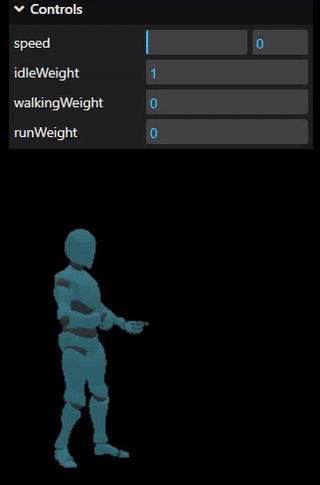

Just a simple Blendtree implementation similar to Unity's Blendtrees.
Currently only supports 1 Dimensional blend trees.



# Install

`npm install three three-blendtree`

# Usage

Create a new BlendTree1D object with an array of AnimationAction and a corresponding array of thresholds. 
In your update method, call the updateWeights method with some value.  Anything outside of the range of thresholds will be clamped to the first and last animations respectively. 
Optionally specify true/false for an overdrive parameter. For values greater than the last threshold, the timescale of the last animation will be scaled up to match.  

```
import { BlendTree1D } from 'three-blendtree';
...
loader.load( 'some_model_with_animations.glb', function ( gltf ) {
    scene.add( gltf.scene );
    mixer = new THREE.AnimationMixer( gltf.scene );
    gltf.animations.forEach(clip => {
        const action = mixer.clipAction(clip);
       // action.play();
        
        animations[clip.name] = action;
        console.log(clip.name  );
    });

   blendTree= new BlendTree1D([animations['idle'],animations['walking'],animations['run']],[0,1.21,2.8],false);
});

...

function animate() {
	requestAnimationFrame( animate );
    const dt = clock.getDelta();
	if(mixer) mixer.update( dt );

    blendTree.updateWeights(someValue);
 
}
```